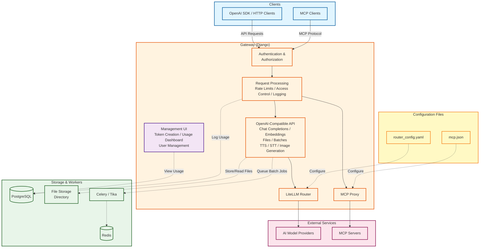

<div align="center">
  
</div>

# Aqueduct AI Gateway

[](LICENSE)
[](https://github.com/tu-wien-datalab/aqueduct/commits/main)
[](https://www.repostatus.org/#wip)
[](https://tu-wien-datalab.github.io/aqueduct/)


> [!NOTE]
> This project is still in active development! Contributions welcome!

**Aqueduct AI Gateway** aims to provide a **simple yet fully-featured** AI gateway you can self-host with **MCP server support**:

- no [SSO tax](https://konghq.com/pricing)
- no [observability tax](https://www.litellm.ai/enterprise)
- no [self-hosting tax](https://portkey.ai/pricing)
- no [org management tax](https://www.litellm.ai/enterprise)
- etc.

We aim to achieve this by:

- Building on top of the **LiteLLM Router SDK** to provide enhanced control and routing capabilities, while avoiding re-implementing the entire OpenAI-compatible APIs or every new feature, and
- Using **Django** for a clean, efficient, and maintainable implementation.

For more information, please read the [Documentation](https://tu-wien-datalab.github.io/aqueduct/).

If you don’t need user self-service, take a look at [Envoy AI Gateway](https://aigateway.envoyproxy.io) instead!


## Quick Start

The recommended way to get Aqueduct running locally is with Docker Compose. This will start the Django app, a PostgreSQL
database, Celery with Redis as the broker, Tika for text extraction from files, and a local mock OIDC provider (Dex)
for authentication.

1. **Clone the repository**
   ```bash
   git clone https://github.com/tu-wien-datalab/aqueduct.git
   cd aqueduct
   ```

2. **Set the necessary environment variables**
Most of the necessary environment variables are provided in the `.example.env` file.
You only need to set the `OPENAI_API_KEY`:
   ```bash
   export OPENAI_API_KEY="your-openai-api-key"
   ```
   This variable is used by the sample router configuration, provided in the
`example_router_config.yaml` file. Adjust it if you want to use other models.

3. **Start the services**
   ```bash
   docker compose up --build
   ```
   This will build and start all required services using the provided `.example.env` and
`example_router_config.yaml` files for environment variables and the router configuration.

4. **Access the application**

    - The web UI will be available at [http://localhost:8000](http://localhost:8000)
    - The local OIDC provider (Dex) will be running at [http://localhost:5556/dex](http://localhost:5556/dex)
    - Default login credentials for Dex are:
        - **Username:** `you@example.com`
        - **Password:** `1234`

You can now access the admin UI and start exploring the gateway features.

> **NOTE:**
> This starts Django in debug mode and is not suitable for production deployments. Change the
> [necessary settings](https://docs.djangoproject.com/en/5.2/topics/settings/#the-basics) for a production deployment.


For other installation methods, check out the [Getting Started Guide](https://tu-wien-datalab.github.io/aqueduct/getting-started/).

## Testing

```bash
cd aqueduct && python manage.py test
```

## Architecture



### Core Features
- **Token Authentication** - Django-based API token authentication with OIDC support
- **Model Access Control** - Hierarchical model exclusion lists (Org → Team → User)
- **Rate Limiting** - Multi-level limits (requests/min, input/output tokens per minute)
- **Usage Tracking** - Comprehensive request logging and analytics
- **File Processing** - Apache Tika integration for text extraction from documents

### Role-Based Access Control
- **User** - API key generation and personal usage
- **Team-Admin** - Team management and member access
- **Org-Admin** - Organization-wide user management
- **Admin** - Global settings and system configuration

### OpenAI-Compatible API
- Streaming and non-streaming completions
- Chat completions with file content support
- Embeddings generation
- Batch API for high-throughput workloads
- File upload and processing
- Audio speech synthesis and transcription
- Image generation

### MCP Integration
- MCP server management for enhanced tool calling
- Custom MCP server endpoints via HTTP proxy
- Session-based MCP protocol support
- DNS rebinding protection for security

## Links

[Documentation](https://tu-wien-datalab.github.io/aqueduct/) | [Issues](https://github.com/TU-Wien-dataLAB/aqueduct/issues)
