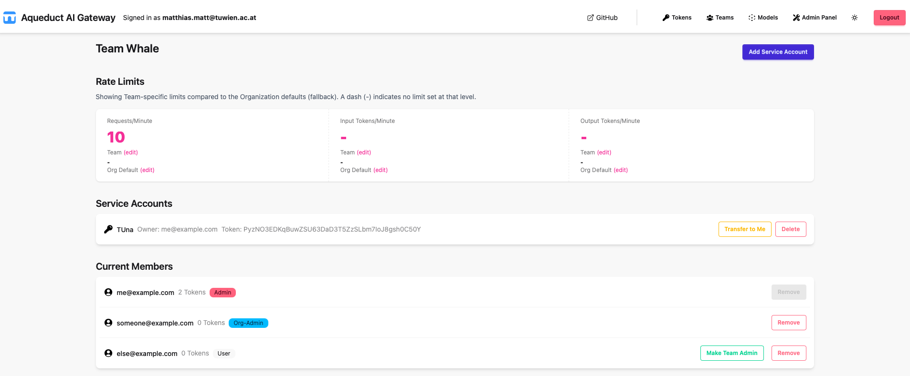

  

# Aqueduct AI Gateway

**Aqueduct AI Gateway** aims to provide a **simple yet fully-featured** AI gateway you can self-host with:

- no [SSO tax](https://konghq.com/pricing)  
- no [observability tax](https://www.litellm.ai/enterprise)  
- no [self-hosting tax](https://portkey.ai/pricing) 
- no [org management tax](https://www.litellm.ai/enterprise)
- etc.

We aim to achieve this by:
- Using a **pass-through approach** that avoids re-implementing the entire OpenAI-compatible APIs or every new feature, and  
- Building on **Django** for a clean, efficient, and maintainable implementation.

If you don’t need user self-service, take a look at [Envoy AI Gateway](https://aigateway.envoyproxy.io) instead!

> [!NOTE]
> This project is still in active development! Contributions welcome!

## 🛠️ Technical Overview

This project aims to use Django for user management/API with minimal additional implementation to create a comprehensive AI gateway. The implementation follows a phased approach:

1. **Data Model and Administrative Interface:**
    * Implementation of "Teams" and "Organizations" within the data model.
    * Development of an administrative UI using Django for user, team and token management.
    * Focus on authentication and basic management functionalities.

2. **Gateway Relay and Usage Tracking:**
    * Development of a gateway server to relay requests to LLM providers.
    * A `/models` endpoint to list available models.
    * Request routing to specific provider endpoints based on model selection.
    * Request parsing for usage tracking.
    * Database schema optimization for write-heavy usage logging.
    * Request buffering for usage logging.

3. **Advanced Features:**
    * Granular access control based on models and usage limits.
    * A `/metrics` endpoint for monitoring.
    * Dashboard to track usage of orgs, teams and users.
    * Model cooldown and retry logic.
    * Management of MCP tool calling server endpoints e.g. from the [MCP Server list](https://github.com/modelcontextprotocol/servers?tab=readme-ov-file).
    * Daily usage quotas/limits for models.
    * Simple chat interface to try models.

4. **(Optional) API Abstraction:**
    * Implementation of a stable API interface (e.g., OpenAI-compatible).
    * Development of backend adapters for different LLM providers.

## ⚙️ Architecture

The gateway server processes requests, interacts with the Django API for token verification, and updates usage logs. Django frontend provides a UI with role-based access control:

**Role-Based Access Control (RBAC):**

| Role           | Functionality                                                     |
| -------------- |-------------------------------------------------------------------|
| User           | API key generation, team key viewing.                             |
| Team-Admin     | Team API key management, team usage viewing.                      |
| Org-Admin      | Team creation, user management within the organization.           |
| (Super)Admin   | Organization management, global usage limit modification.         |

**Organization and User Management:**

* User assignment to organizations based on SSO group memberships.
* Specific admin group used to assign Admins.
* Org-Admin management by Admin in UI (group).

**Usage Reporting and Metrics:**

* Usage reports based on user roles (team, organization, global).
* `/metrics` endpoint for system monitoring + usage.

## 🚀 Implementation Roadmap

1. Implementation user management in Django.
2. Implementation of gateway server with basic features using user management as service.
3. Create docker compose setup.
4. Extension of gateway/management service for more advanced features.

## ❓ Open Questions

* Integration of Open Policy Agent (OPA) for authorization and policy enforcement?

## 🔗 Relevant Links

* [Token Validator](https://github.com/TU-Wien-dataLAB/token-validator)