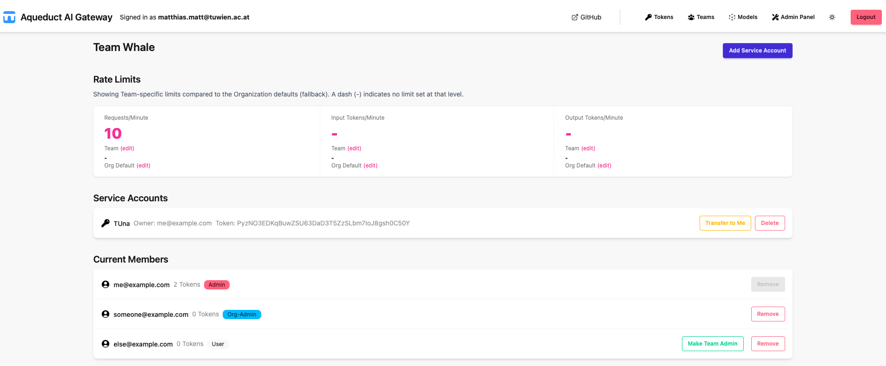

# Aqueduct AI Gateway

**Aqueduct AI Gateway** aims to provide a **simple yet fully-featured** AI gateway you can self-host with:

- no [SSO tax](https://konghq.com/pricing)
- no [observability tax](https://www.litellm.ai/enterprise)
- no [self-hosting tax](https://portkey.ai/pricing)
- no [org management tax](https://www.litellm.ai/enterprise)
- etc.

## Key Features

- **Role-Based Access Control:** Manage users, teams, and organizations with flexible permissions.
- **Usage Tracking:** Monitor and limit API usage by organization, team, or user.
- **OpenAI-Compatible Relay:** Seamlessly proxy requests to LLM providers.
- **Admin UI:** Manage everything through a clean Django admin interface.

## Quick Start

To get started with the Aqueduct AI Gateway, navigate to the Tokens page for your Aqueduct instance and create a new token. The URL of the web UI depends on your specific Aqueduct deployment. See the [Tokens](user-guide/tokens.md) page for details.

Once you have your token, use your Aqueduct instance's base URL (e.g., `https://your-instance.com/v1`) with OpenAI-compatible SDKs, providing the token as your API key.

---

Explore the navigation to learn more about configuration, usage, and advanced features.
