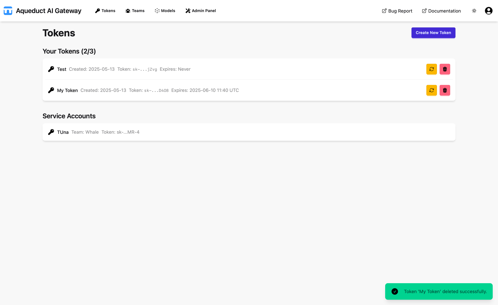
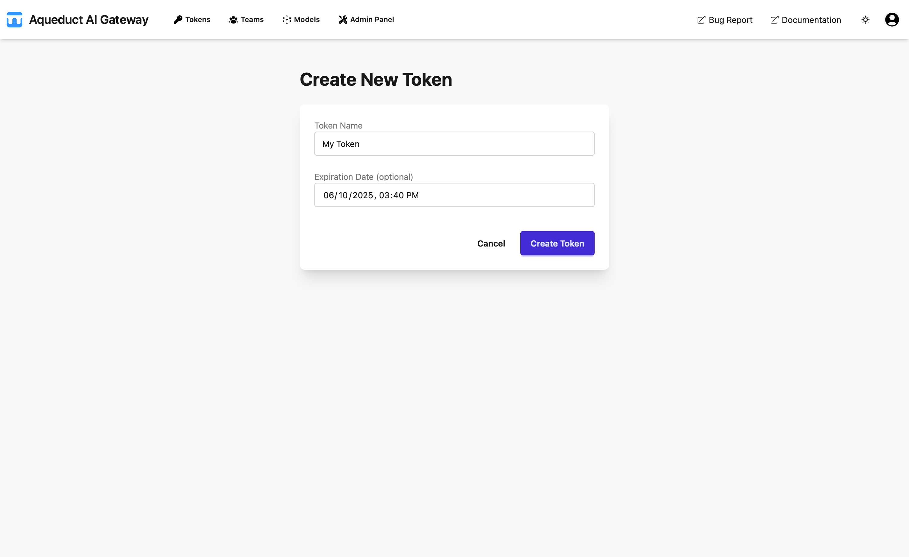
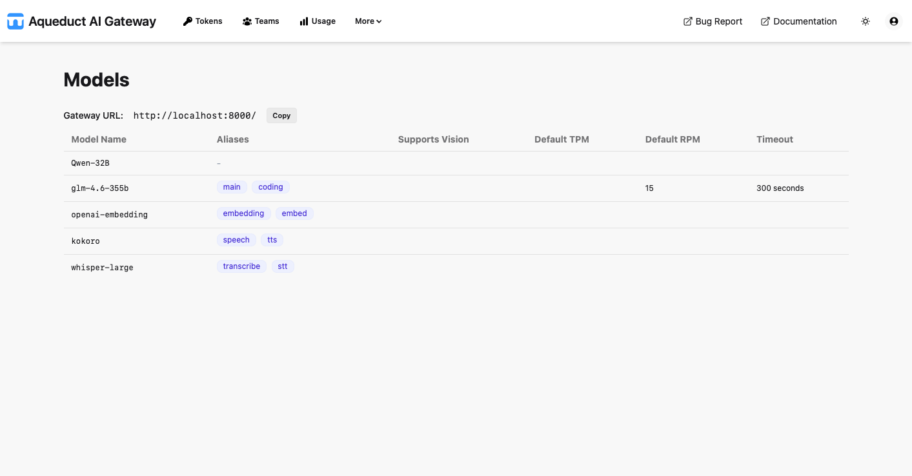

# User Guide

## Navigation

The main sections of the Aqueduct AI Gateway are the Tokens page, Teams page, Models page, and the Admin Panel.

The Tokens page allows users to manage tokens. The Teams page provides functionality to view and manage teams. The Models page displays accessible models and endpoints. The Admin Panel is used for advanced administration.

## Tokens Page

By default, the application opens on the Tokens page, where users can view their accessible tokens, including personal tokens and those from service accounts.



Users can create new tokens to access models (LLMs) via the API. Only a preview of the token is shown, as the actual value is not stored in the database. Users must copy and save the token value upon creation, for example in a password manager such as 1Password.

Note: Aqueduct functions as a pass-through, so the API is determined by the model provider. Currently, only OpenAI-compatible APIs are supported, including local models via vLLM or other OpenAI-compatible servers, as well as the OpenAI API.

A created token is valid for all available models and is used for API authentication. Tokens become invalid upon expiration and cannot be used for authentication thereafter. Tokens without an expiration date never expire.

To create a token, click the "Create New Token" button to open the token creation form.



Users can assign a name to the token and set an expiration date. To create a token that never expires, leave the expiration date blank. Token values are randomly generated and cannot be set manually.

There is a fixed limit to the number of tokens a user can generate. This limit does not apply to service accounts, which have a separate, predefined limit.

Token values can be regenerated for existing tokens using the regenerate ("🔄") button. Tokens can be deleted using the delete ("🗑") button.

Service accounts are managed in the Teams view by users with Team Admin permissions.

## Teams Page

The Teams page displays a list of teams within the organization.


Users can view the default organization limits, which apply to tokens when no team or user-specific limits are set. Limits include Requests per Minute, Input Tokens per Minute, and Output Tokens per Minute. Admins can modify these limits in the Admin Panel.

**If a request exceeds any of these limits, the API will respond with a 429 HTTP error (Too Many Requests).**

Organization Admins can create new teams using the "Create New Team" button, which opens the team creation form. Here, the team name and description can be set.

Organization Admins can also delete teams using the delete ("🗑") button in the team list.

### Team Detail Page

Clicking on a team in the list opens the Team Detail page.


This page displays the team limits, which function similarly to organization limits. If no team limit is set, the organization limit is used by default.

Below the limits, the service accounts associated with the team are listed. Users with Team Admin privileges can create service accounts using the "Add Service Account" button. Service accounts require a name and description, and a token is generated upon creation. The user who creates the service account owns the associated token.

Ownership of a service account token can be transferred to another user within the team. A user who owns a service account cannot be removed from the team.

Service account tokens can be regenerated, and service accounts can be deleted, which also deletes the associated token. Service accounts can be edited to change their name and description.

Below the service accounts list, team members are displayed. Each member has a tag indicating their permissions (User, Team-Admin, Org-Admin, or Admin). Standard users can be promoted to Team-Admin. Users without service accounts can be removed from the team.

Users who are not part of a team can be added using the "Add Users to Team" function. Any user in the organization can be added to a team.

## Models Page

The Models page displays the available endpoints and their associated models.



Each endpoint has a slug, which is included in the Aqueduct URL path to distinguish the endpoint in API calls. The remaining path is forwarded to the actual endpoint (Internal URL). For example, a call to `/vllm/v1/models` will forward `v1/models` to the Internal URL of the `vllm` endpoint. If a model is referenced in the call, it must be part of the endpoint.

Admins can add and edit endpoints and models in the Admin Panel.

## Admin Panel

The Admin Panel is the Django Admin interface for the Aqueduct Gateway. It provides direct access to database objects. Actions restricted to admins, such as creating models, are performed through this interface.


## Example: OpenAI-Compatible API Call

Aqueduct supports OpenAI-compatible APIs. You can use the official OpenAI Python SDK to interact with Aqueduct endpoints. Below is an example of how to make a call using your Aqueduct token:

```python
import openai

openai.api_key = "YOUR_AQUEDUCT_TOKEN"
openai.api_base = "https://your-aqueduct-domain.com/vllm"  # Replace with your Aqueduct endpoint

response = openai.ChatCompletion.create(
    model="your-model-name",  # Replace with your model name
    messages=[
        {"role": "system", "content": "You are a helpful assistant."},
        {"role": "user", "content": "Hello, who are you?"}
    ]
)

print(response.choices[0].message["content"])
```

Replace `YOUR_AQUEDUCT_TOKEN`, `https://your-aqueduct-domain.com/vllm`, and `your-model-name` with your actual token, Aqueduct endpoint, and model name.
