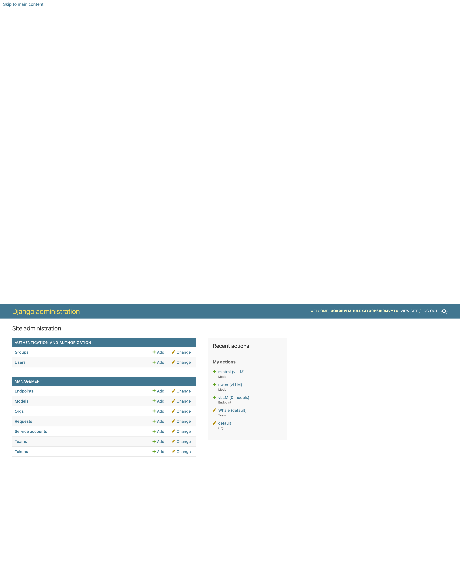
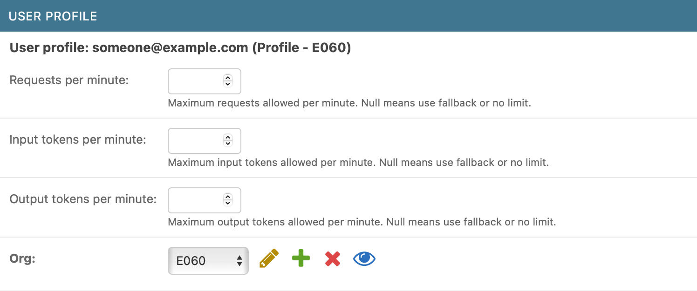

# Admin
{: .no_toc }

## Table of contents
{: .no_toc .text-delta }

1. TOC
{:toc}

---

The Admin Panel is the Django Admin interface for the Aqueduct Gateway. It provides direct access to database objects and is used for advanced administrative actions, such as creating endpoints and models or managing user privileges.

## Managing User Permissions

Admins can manage the permissions of other users through the Django Admin interface. User permissions are controlled using Django's built-in groups. The main groups used in Aqueduct are:

- `user`
- `org-admin`
- `admin`

To grant a user admin privileges, you must assign them to the `admin` group and ensure that both the "staff" and "superuser" flags are set to `True` in the Django Admin. If you wish to promote a user to `org-admin`, change their group from `user` to `org-admin` and remove the `user` group from their group list.

**Team admins** are managed differently: they are assigned through a many-to-many relationship between users and teams, which is handled in the Aqueduct UI. For more information, see the [Teams page](teams.md).

## Managing Organizations

As an admin, you can assign yourself or other users to different organizations within the admin panel. This is useful if you need to administer multiple organizations. Organization assignments are managed within the user model in the admin interface, where the organization is presented as part or the user profile.

> **Note:** Organization assignments made in the admin panel may be overwritten on the user's next login, as user data is updated during authentication.

## Managing User Limits

You can also change the request usage limits for individual users within the UserProfile inline model. This functionality is currently not available in the main UI and must be performed through the Django Admin interface.
