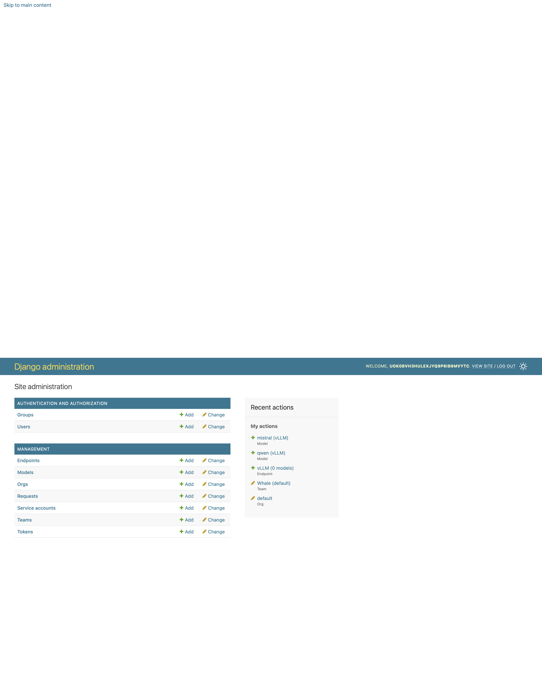
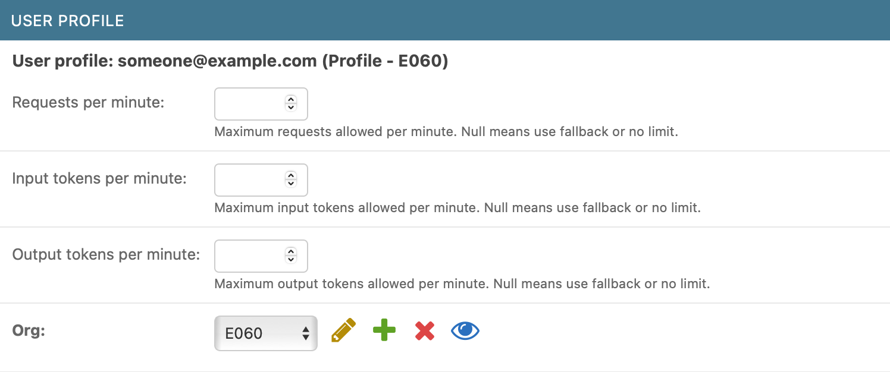

# Admin
{: .no_toc }

## Table of contents
{: .no_toc .text-delta }

1. TOC
{:toc}

---

The Admin Panel is the Django Admin interface for the Aqueduct Gateway. It provides direct access to database objects and is used for advanced administrative actions, such as creating endpoints and models or managing user privileges.



## Managing User Permissions

Admins can manage the permissions of other users through the Django Admin interface. User permissions are controlled using Django's built-in groups. The main groups used in Aqueduct are:

- `user`
- `org-admin`
- `admin`

To grant a user admin privileges, you must assign them to the `admin` group and ensure that both the "staff" and "superuser" flags are set to `True` in the Django Admin. If you wish to promote a user to `org-admin`, change their group from `user` to `org-admin` and remove the `user` group from their group list.

**Team admins** are managed differently: they are assigned through a many-to-many relationship between users and teams, which is handled in the Aqueduct UI. For more information, see the [Teams page](teams.md#team-detail-view).

## OAuth Team Management

OAuth team management automatically syncs user team memberships based on OAuth groups at login. When enabled, users are added to teams corresponding to their OAuth groups, and teams can be created automatically.

### Configuration

| Setting | Purpose |
|---------|---------|
| `ENABLE_OAUTH_GROUP_MANAGEMENT` | Master switch - when `False`, no team sync happens on login |
| `ENABLE_OAUTH_GROUP_CREATION` | When `True`, teams are auto-created from OAuth groups; when `False`, users only join existing teams |
| `ENABLE_OAUTH_GROUP_REMOVAL` | Controls removal from **non-OAuth** teams only. When `True` (default), users are removed from all teams not in their OAuth groups. When `False`, users stay in manually created teams but are **always** removed from OAuth-managed teams when they lose the corresponding OAuth group |
| `OAUTH_TEAM_NAMES_FROM_GROUPS_FUNCTION` | Custom logic to transform individual group names |

### Function Signature

The `OAUTH_TEAM_NAMES_FROM_GROUPS_FUNCTION` should be a callable with this signature:

```python
def transform_group_name(group: str, groups: list[str] | None = None) -> tuple[str, str] | None:
    """
    Transform a single OAuth group name to a team name.
    
    Args:
        group: The specific OAuth group name to transform
        groups: Full list of user's groups for context (optional)
    
    Returns:
        Tuple of (transformed_team_name, original_group_name) or None to skip this group
    """
```

**Example implementation:**

```python
def my_transform(group: str, groups: list[str] | None = None) -> tuple[str, str] | None:
    """Transform groups starting with 'E' to team names."""
    if group.startswith("E"):
        # Strip suffix after dash: "E123-Students" -> "E123"
        team_name = group.split("-")[0]
        return (team_name, group)
    return None  # Skip this group
```

The function is called once for each OAuth group, allowing you to:
- Filter which groups become teams (return `None` to skip)
- Transform group names (e.g., remove suffixes, add prefixes)
- Access the full groups list for context-aware logic

### How It Works

1. User logs in via OAuth
2. OAuth groups are extracted from claims
3. For each group, `OAUTH_TEAM_NAMES_FROM_GROUPS_FUNCTION` is called with the group name and full groups list
4. Groups that return a tuple create teams; groups that return `None` are skipped
5. Teams are created (if `ENABLE_OAUTH_GROUP_CREATION=True`) or reused
6. User is added to teams via `TeamMembership`
7. User is removed from teams no longer in their OAuth groups (only if `ENABLE_OAUTH_GROUP_REMOVAL=True`)

### Admin Panel

The Teams admin view shows OAuth management status:

- **"OAuth Managed" column** - Shows "Yes" for OAuth-managed teams
- **Filter** - Filter by `oauth_group_name` to show only OAuth-managed teams
- **Read-only fields** - Team name, organization, and OAuth group name are read-only for OAuth-managed teams
- **Member management** - Inline member editing is disabled for OAuth-managed teams (sync happens at login)
- **Help text** - OAuth-managed teams display a notice explaining how to update team names via the sync command

Rate limits, descriptions, and exclusions remain editable for OAuth-managed teams.

### Syncing Team Names

When you change the `OAUTH_TEAM_NAMES_FROM_GROUPS_FUNCTION` logic, you can update existing team names using the admin action:

1. Navigate to **Admin → Management → Teams**
2. Select the teams you want to sync (or select all)
3. From the **Action** dropdown, select **"Sync OAuth team names"**
4. Click **Go**

The action will:
1. Read the stored `oauth_group_name` for each selected OAuth-managed team
2. Re-apply the current `OAUTH_TEAM_NAMES_FROM_GROUPS_FUNCTION` mapping
3. Update team names based on the mapping result
4. Skip teams with name collisions or unchanged names
5. Never affect manually created teams (those with empty `oauth_group_name`)
6. Show a warning if any teams would be deleted (deletion requires using the command-line)

> **Note:** Team deletion is not performed via the admin action for safety. If the mapping returns `None` (indicating a team should be deleted), you'll see a warning message. To delete teams, use the command-line or delete them manually in the admin.

## Managing Organizations

As an admin, you can assign yourself or other users to different organizations within the admin panel. This is useful if you need to administer multiple organizations. Organization assignments are managed within the user model in the admin interface, where the organization is presented as part or the user profile.

> **Note:** Organization assignments made in the admin panel may be overwritten on the user's next login, as user data is updated during authentication.



## Managing User Limits

You can also change the request usage limits for individual users within the UserProfile inline model. 
This functionality is currently not available in the main UI and must be performed through the Django Admin interface.

## Excluding Models

To exclude models for Orgs, Teams or specific UserProfiles, select the models to be excluded in the detail view admin interface of the specific entity.
Excluded models are not available in any endpoints (returns 404) and are filtered from the model list.


### Merge Exclusion Lists

The `merge_exclusion_lists` field determines how exclusion lists are built across the User, Team, Org, and global settings levels. When `merge_exclusion_lists` is enabled, the exclusion list for an entity is constructed by merging its own list with those from higher levels—moving upward through Org and finally the global settings. If `merge_exclusion_lists` is disabled at any level, merging stops there, and higher-level exclusions (including global) are not included.

**Example:**  
Suppose a User has an exclusion list `["A", "B"]` and `merge_exclusion_lists=True`; their Org has `["C"]` with `merge_exclusion_lists=False`; and the global exclusion list is `["D"]`. The effective exclusion list for the User would be `["A", "B", "C"]`—the Org's `merge_exclusion_lists=False` means the global settings are ignored.

This system provides fine-grained control over how and where model exclusions are inherited.

## Excluding MCP Servers

Similar to model exclusions, you can exclude specific MCP servers for Organizations, Teams, or UserProfiles through the admin interface. This prevents users from accessing certain MCP servers while allowing access to others.

To exclude MCP servers:
1. Navigate to the Org, Team, or UserProfile detail view in the Django Admin
2. In the "Excluded MCP Servers" section, select the servers you want to exclude
3. Save the changes

When an MCP server is excluded:
- Requests to that server return a 404 error
- The server is effectively unavailable to users in that scope

### MCP Server Exclusion Hierarchy

MCP server exclusions follow the same hierarchical pattern as model exclusions:

- **For User Tokens**: UserProfile → Org → Global Settings
- **For Service Account Tokens**: Team → Org → Global Settings

The `merge_mcp_server_exclusion_lists` field works identically to `merge_exclusion_lists`:
- When enabled (default), the exclusion list includes servers from the current level plus all higher levels
- When disabled, only the current level's exclusions apply, stopping the upward merge

**Example:**  
A Team excludes `["server-a"]` with merge enabled; its Org excludes `["server-b"]` with merge disabled; global settings exclude `["server-c"]`. Service accounts in that Team would have an effective exclusion list of `["server-a", "server-b"]`—the Org's merge disabled prevents the global `server-c` from being included.

You can configure the global default MCP server exclusion list in `settings.py` using the `AQUEDUCT_DEFAULT_MCP_SERVER_EXCLUSION_LIST` setting (defaults to an empty list).

## MCP Server Configuration

MCP servers are configured through a JSON file referenced in `settings.py` via `MCP_CONFIG_FILE_PATH` (defaults to "mcp.json"). Each server configuration includes:

- **type**: Transport type (e.g., "streamable-http")
- **url**: Server endpoint URL
- **description**: Server description
- **tags**: Categories for organization

**Example configuration**:
```json
{
  "mcpServers": {
    "test-server": {
      "type": "streamable-http",
      "url": "http://localhost:3001/mcp",
      "description": "For Streamable HTTP connections",
      "tags": ["development", "testing"]
    }
  }
}
```
