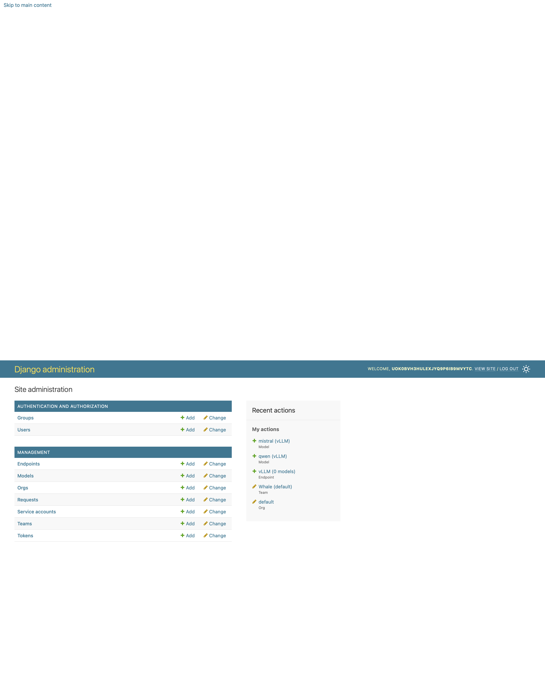
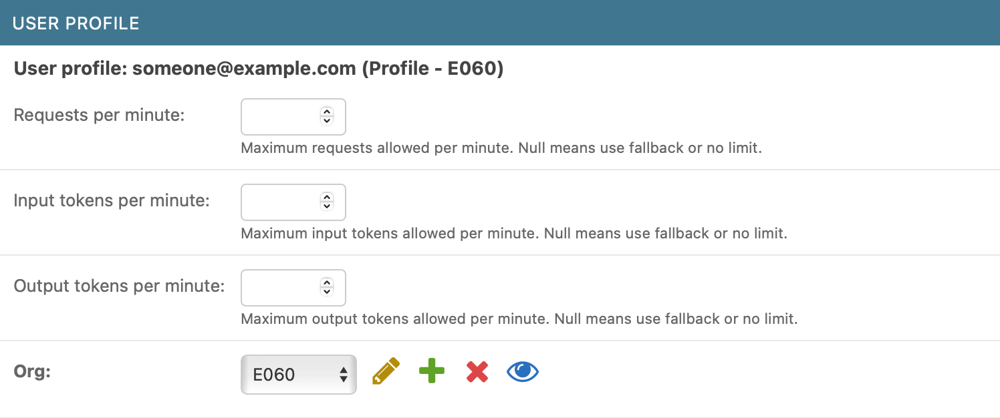

# Admin
{: .no_toc }

## Table of contents
{: .no_toc .text-delta }

1. TOC
{:toc}

---

The Admin Panel is the Django Admin interface for the Aqueduct Gateway. It
provides direct access to database objects and is used for advanced
administrative actions, such as creating endpoints and models or managing user
privileges.



## Configuration Snippets

Runtime OIDC/auth configuration is provided by a **config snippet** — a Python
class stored in the database, editable at runtime by **superusers**. Snippet
code subclasses the auto-injected `ConfigSnippet` base class (no import needed)
and overrides only the methods you need:

```python
class MyConfig(ConfigSnippet):
    def org_name(self, claims):
        # Optional: extract the organization name from OIDC claims.
        # None fails closed (no org => no login). Default: "default".
        groups = claims.get("groups") or []
        return groups[0] if groups else None

    def team_names(self, claims):
        # Optional: extract raw team (group) names from OIDC claims.
        groups = claims.get("groups") or []
        return [g for g in groups if g.startswith("E")]

    def display_team_names(self, team_names):
        # Optional: map each raw group name to (display_team_name, team_name).
        # Example: "E123-Students" -> ("E123", "E123-Students")
        return [(t.split("-", 1)[0], t) for t in team_names]

    def user_group(self, claims):
        # Optional: return "admin" / "org-admin" / "user" from claims.
        # "admin" sets is_staff/is_superuser. Default: "user".
        return "user"
```

The four methods, signatures, and failure behavior:

| Method | Signature | Failure behavior |
|--------|-----------|------------------|
| `org_name` | `(claims) -> str \| None` | fail closed (`None` ⇒ no login) |
| `team_names` | `(claims) -> list[str]` | fail open (`[]`) |
| `display_team_names` | `(team_names) -> list[(str, str)]` | identity mapping (names unchanged) |
| `user_group` | `(claims) -> "admin" \| "org-admin" \| "user"` | fail open (`"user"`) |

At most one `config` snippet may be active at a time. Without one, the defaults
apply: org `"default"`, no teams, and the `user` role. A snippet must be valid
Python, with correct method signatures and a class inheriting from
`ConfigSnippet`; the admin form rejects anything else. Snippet changes take
effect on the next login — editing or running the snippet in the test console
recompiles it.

### Auto-admin via `ADMIN_GROUP`

Set the `ADMIN_GROUP` environment variable to the name of a group whose
members should automatically become admins (`is_staff` + `is_superuser`) on
login — e.g. `ADMIN_GROUP=default`. Leave `ADMIN_GROUP` empty (default) to
disable this. It only applies when OAuth group management is enabled (see
`ENABLE_OAUTH_GROUP_MANAGEMENT`).

> **Security:** a snippet is arbitrary Python executed on the server, so editing
> is **superuser-only** and there is **no sandboxing**. The **test console** lets
> you run a snippet against a sample input before saving (also superuser-only).

### Auto-admin via `ADMIN_SUPERUSER_EMAILS`

Set the `ADMIN_SUPERUSER_EMAILS` environment variable to a comma-separated list
of emails that are always made admins (`is_staff` + `is_superuser`) on login,
regardless of their group. Leave it empty (default) to disable this.

Only emails on this list are allowed to use the Snippet admin (editing and the
test console).

## Managing User Permissions

Admins can manage the permissions of other users through the Django Admin
interface. User permissions are controlled using Django's built-in groups. The
main groups used in Aqueduct are:

- `user`
- `org-admin`
- `admin`

To grant a user admin privileges, you must assign them to the `admin` group and
ensure that both the "staff" and "superuser" flags are set to `True` in the
Django Admin. If you wish to promote a user to `org-admin`, change their group
from `user` to `org-admin` and remove the `user` group from their group list.

When users log in via OIDC, their group and staff/superuser flags are re-derived
from the active config snippet's `user_group(claims)`, so manual admin edits may
be overwritten on next login unless the snippet keeps them in an admin group.

**Team admins** are managed differently: they are assigned through a many-to-many
relationship between users and teams, which is handled in the Aqueduct UI. For
more information, see the [Teams page](teams.md#team-detail-view).

## OAuth Team Management

OAuth team management automatically syncs user team memberships based on OAuth
groups at login. When enabled, users are added to teams corresponding to their
OAuth groups, and teams can be created automatically.

### Configuration

| Setting | Purpose |
|---------|---------|
| `ENABLE_OAUTH_GROUP_MANAGEMENT` | Master switch - when `False`, no team sync happens on login |
| `ENABLE_OAUTH_GROUP_CREATION` | When `True`, teams are auto-created from OAuth groups; when `False`, users only join existing teams |
| `ENABLE_OAUTH_GROUP_REMOVAL` | Controls removal from **non-OAuth** teams only. When `True` (default), users are removed from all teams not in their OAuth groups. When `False`, users stay in manually created teams but are **always** removed from OAuth-managed teams when they lose the corresponding OAuth group |

The team-name mapping logic is provided by the active **config snippet's**
`team_names` / `display_team_names` methods (see
[Configuration Snippets](#configuration-snippets)).

### Admin Panel

The Teams admin view shows OAuth management status:

- **"OAuth Managed" column** - Shows "Yes" for OAuth-managed teams
- **Filter** - Filter by `oauth_group_name` to show only OAuth-managed teams
- **Read-only fields** - Team name, organization, and OAuth group name are read-only for OAuth-managed teams
- **Member management** - Inline member editing is disabled for OAuth-managed teams (sync happens at login)
- **Help text** - OAuth-managed teams display a notice explaining how to update team names via the sync command

Rate limits, descriptions, and exclusions remain editable for OAuth-managed
teams.

### Syncing Team Names

When you change the `display_team_names` logic in the active config snippet,
you can update existing team names using the admin action:

1. Navigate to **Admin → Management → Teams**
2. Select the teams you want to sync (or select all)
3. From the **Action** dropdown, select **"Sync OAuth team names"**
4. Click **Go**

The action will:
1. Read the stored `oauth_group_name` for each selected OAuth-managed team
2. Re-apply the current `display_team_names` mapping from the active config snippet
3. Update team names based on the mapping result
4. Skip teams with name collisions or unchanged names
5. Never affect manually created teams (those with empty `oauth_group_name`)
6. Show a warning if any teams would be deleted (deletion requires using the command-line)

> **Note:** Team deletion is not performed via the admin action for safety. If the mapping returns nothing for a team (indicating it should be deleted), you'll see a warning message. To delete teams, use the command-line or delete them manually in the admin.

## Managing Organizations

As an admin, you can assign yourself or other users to different organizations
within the admin panel. This is useful if you need to administer multiple
organizations. Organization assignments are managed within the user model in
the admin interface, where the organization is presented as part or the user
profile.

> **Note:** Organization assignments made in the admin panel may be overwritten
> on the user's next login, as user data is updated during authentication.



## Managing User Limits

You can also change the request usage limits for individual users within the
UserProfile inline model. This functionality is currently not available in the
main UI and must be performed through the Django Admin interface.

## Excluding Models

To exclude models for Orgs, Teams or specific UserProfiles, select the models to
be excluded in the detail view admin interface of the specific entity. Excluded
models are not available in any endpoints (returns 404) and are filtered from
the model list.


### Merge Exclusion Lists

The `merge_exclusion_lists` field determines how exclusion lists are built
across the User, Team, Org, and global settings levels. When
`merge_exclusion_lists` is enabled, the exclusion list for an entity is
constructed by merging its own list with those from higher levels—moving
upward through Org and finally the global settings. If `merge_exclusion_lists`
is disabled at any level, merging stops there, and higher-level exclusions
(including global) are not included.

**Example:**  
Suppose a User has an exclusion list `["A", "B"]` and
`merge_exclusion_lists=True`; their Org has `["C"]` with
`merge_exclusion_lists=False`; and the global exclusion list is `["D"]`. The
effective exclusion list for the User would be `["A", "B", "C"]`—the Org's
`merge_exclusion_lists=False` means the global settings are ignored.

This system provides fine-grained control over how and where model exclusions
are inherited.

## Excluding MCP Servers

Similar to model exclusions, you can exclude specific MCP servers for
Organizations, Teams, or UserProfiles through the admin interface. This prevents
users from accessing certain MCP servers while allowing access to others.

To exclude MCP servers:
1. Navigate to the Org, Team, or UserProfile detail view in the Django Admin
2. In the "Excluded MCP Servers" section, select the servers you want to exclude
3. Save the changes

When an MCP server is excluded:
- Requests to that server return a 404 error
- The server is effectively unavailable to users in that scope

### MCP Server Exclusion Hierarchy

MCP server exclusions follow the same hierarchical pattern as model exclusions:

- **For User Tokens**: UserProfile → Org → Global Settings
- **For Service Account Tokens**: Team → Org → Global Settings

The `merge_mcp_server_exclusion_lists` field works identically to
`merge_exclusion_lists`:
- When enabled (default), the exclusion list includes servers from the current level plus all higher levels
- When disabled, only the current level's exclusions apply, stopping the upward merge

**Example:**  
A Team excludes `["server-a"]` with merge enabled; its Org excludes
`["server-b"]` with merge disabled; global settings exclude `["server-c"]`.
Service accounts in that Team would have an effective exclusion list of
`["server-a", "server-b"]`—the Org's merge disabled prevents the global
`server-c` from being included.

You can configure the global default MCP server exclusion list in `settings.py`
using the `AQUEDUCT_DEFAULT_MCP_SERVER_EXCLUSION_LIST` setting (defaults to an
empty list).

## MCP Server Configuration

MCP servers are configured through a JSON file referenced in `settings.py` via
`MCP_CONFIG_FILE_PATH` (defaults to "mcp.json"). Each server configuration
includes:

- **type**: Transport type (e.g., "streamable-http")
- **url**: Server endpoint URL
- **description**: Server description
- **tags**: Categories for organization

**Example configuration**:
```json
{
  "mcpServers": {
    "test-server": {
      "type": "streamable-http",
      "url": "http://localhost:3001/mcp",
      "description": "For Streamable HTTP connections",
      "tags": ["development", "testing"]
    }
  }
}
```
