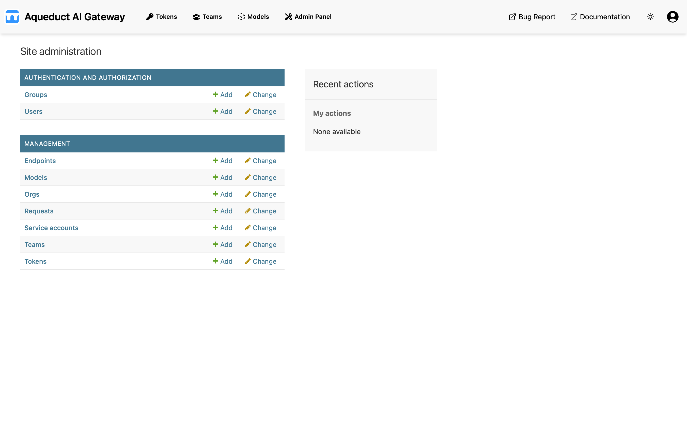

# Admin

The Admin Panel is the Django Admin interface for the Aqueduct Gateway. It provides direct access to database objects.
Actions restricted to admins, such as creating models, are performed through this interface.

