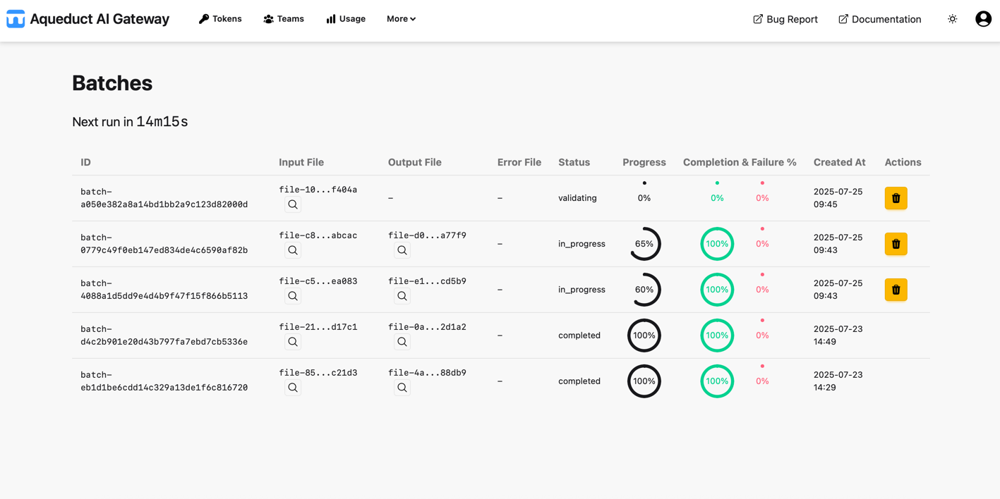

# Batches

On the Batches page, you can view and manage batch jobs created from uploaded newline-delimited JSON (`.jsonl`) files.

The table lists all batch jobs associated with your user. Each row shows:

- **Batch ID**: Unique identifier for the batch job.
- **Input File**: The source JSONL file used for this batch.
- **Output File**: The output JSONL file used for this batch to append results to.
- **Error File**: The error JSONL file used for this batch to append errors to.
- **Status**: Current state of the batch (e.g., `validating`, `in_progress`, `completed`, `failed`, etc.).
- **Progress**: Shows the progress of the batch processing via a radial progress.
- **Completion & Failure %**: Shows the completion (success) and failure percentage of the already processed requests via a radial progress.
- **Created At**: Timestamp when the batch job was created.
- **Actions**: Button to cancel the batch. Only batches with the status `validating` or `in_progress` can be canceled.

Input/Output and Error files can be previewed similar to the Files view (🔎 icon).
Only batches with status `validating` or `in_progress` count towards the batch limit for users and teams.

Batch processing happens at a fixed interval, in which not yet processed batches (with status `validating`) are added to the queue.
The countdown for the next run is shown on the top left. If the batch could not be processes within the run its status may stay `validating`.