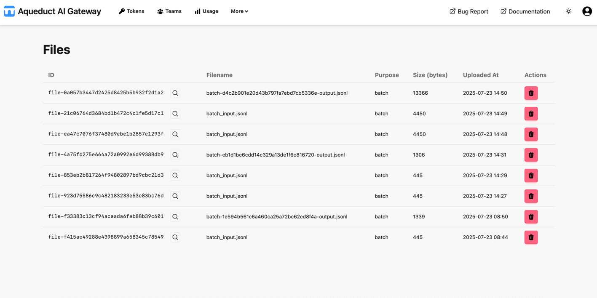

# Files

On the Files page, you can manage uploaded files through the [Files API](../api/files.md). 

The table lists all files you have uploaded. Each row displays:

- **ID**: The file ID with a button to show a preview of the file (🔎 icon).
- **Filename**: The name of the uploaded file.
- **Purpose**: The intended use for the file (e.g., `batch`).
- **Size**: The file size in bytes.
- **Uploaded At**: The timestamp when the file was uploaded.
- **Actions**: Button to delete the file.
