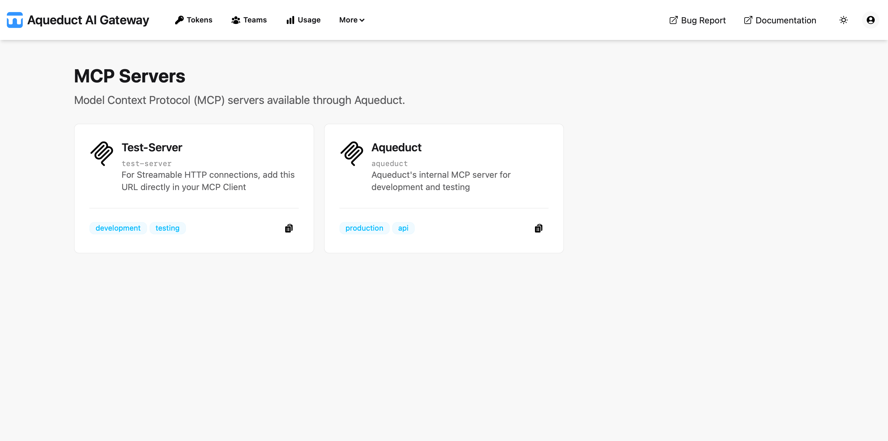

# MCP Servers
{: .no_toc }

## Table of contents
{: .no_toc .text-delta }

1. TOC
{:toc}

---

The MCP Servers page displays a list of Model Context Protocol (MCP) servers available in Aqueduct. MCP servers provide tools and capabilities that can be accessed through the Model Context Protocol.



## MCP Servers

Each MCP server card represents a configured endpoint that provides specific tools and functionality. The cards display both a formatted display name and the actual server identifier.

The server name shown in monospace font below the card title is the exact identifier you must use when making MCP requests through the API endpoints.

## Server Information

Each MCP server card displays:

- **Display Name**: Formatted, capitalized name for visual identification
- **Server Identifier**: The actual name to use in API requests (shown in small monospace text)
- **Description**: Brief description of what the server provides
- **Tags**: Categories or labels to help identify server capabilities
- **Copy Button**: Click to copy the full server URL to the clipboard

## Usage

To use an MCP server:

1. **Copy Server URL**: Click the copy button <span class="size-4 inline-block"></span> on any server card to copy the complete endpoint URL to your clipboard

2. **Use in API**: Make requests to the copied URL using your Aqueduct token

**Example**: If the server name is `my-cool-server`, the URL is:
```
https://your-aqueduct-domain.com/mcp-servers/my-cool-server/mcp
```

For detailed API usage examples and specifications, refer to the [MCP API reference](../api/mcp.md).