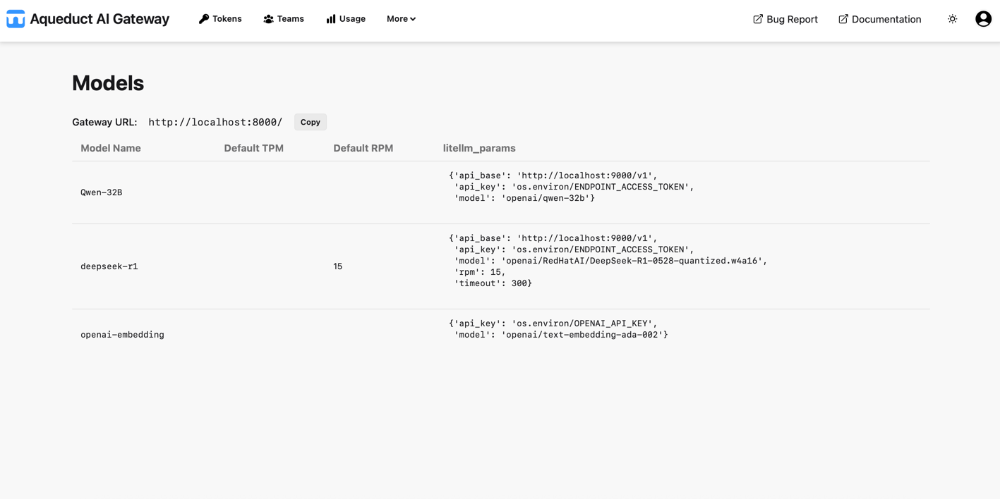

# Models

On the Models page, you can view the available endpoints and their associated models.

Each endpoint has a slug, which is included in the Aqueduct URL path to distinguish the endpoint in API calls. The remaining path is forwarded to the actual endpoint (Internal URL). For example, when you call `/vllm/v1/models`, `v1/models` is forwarded to the Internal URL of the `vllm` endpoint. If you reference a model in the call, it must be part of the endpoint.

As an admin, you can add and edit endpoints and models in the Admin Panel.
