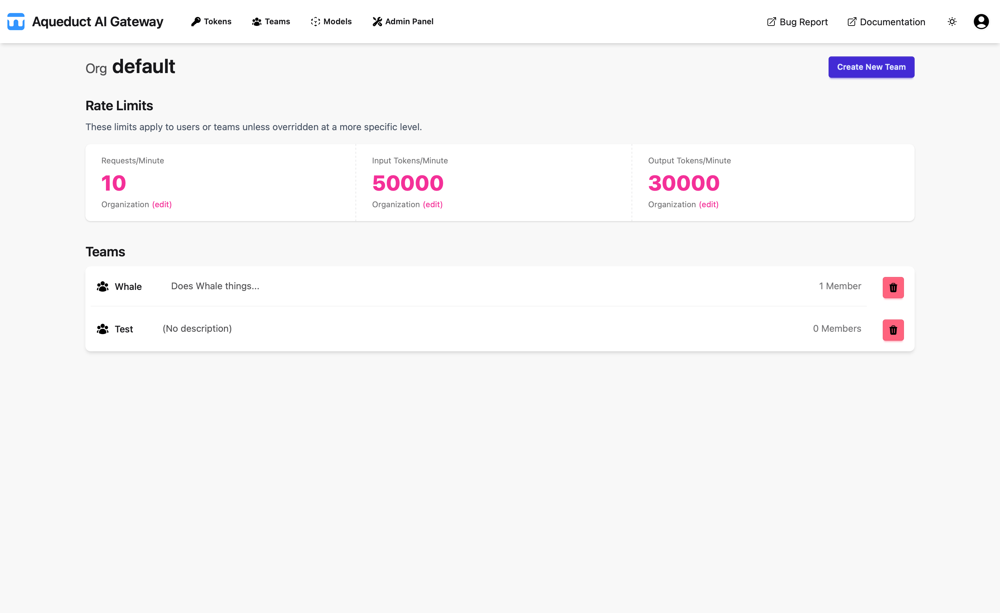
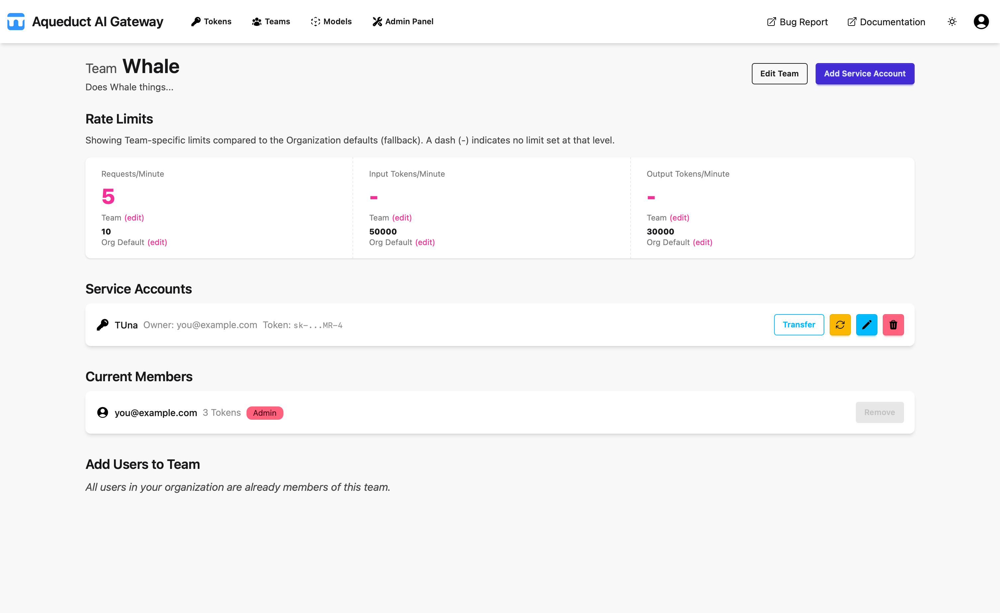

# Teams
{: .no_toc }

## Table of contents
{: .no_toc .text-delta }

1. TOC
{:toc}

---

## Teams View

The Teams page displays a list of teams within the organization.

Users can view the default organization limits, which apply to tokens when no team or user-specific limits are set.
Limits include Requests per Minute, Input Tokens per Minute, and Output Tokens per Minute. Admins can modify these
limits in the Admin Panel.

**If a request exceeds any of these limits, the API will respond with a 429 HTTP error (Too Many Requests).**

Organization Admins can create new teams using the "Create New Team" button, which opens the team creation form. Here,
the team name and description can be set.

Organization Admins can also delete teams using the delete ("🗑") button in the team list.

## Team Detail View

Clicking on a team in the list opens the Team Detail page.

This page displays the team limits, which function similarly to organization limits. If no team limit is set, the
organization limit is used by default.

Below the limits, the service accounts associated with the team are listed. Users with Team Admin privileges can create
service accounts using the "Add Service Account" button. Service accounts require a name and description, and a token is
generated upon creation. The user who creates the service account owns the associated token.

Ownership of a service account token can be transferred to another user within the team. A user who owns a service
account cannot be removed from the team.

Service account tokens can be regenerated, and service accounts can be deleted, which also deletes the associated token.
Service accounts can be edited to change their name and description.

Below the service accounts list, team members are displayed. Each member has a tag indicating their permissions (User,
Team-Admin, Org-Admin, or Admin). Standard users can be promoted to Team-Admin. Users without service accounts can be
removed from the team.

Users who are not part of a team can be added using the "Add Users to Team" function. Any user in the organization can
be added to a team.
