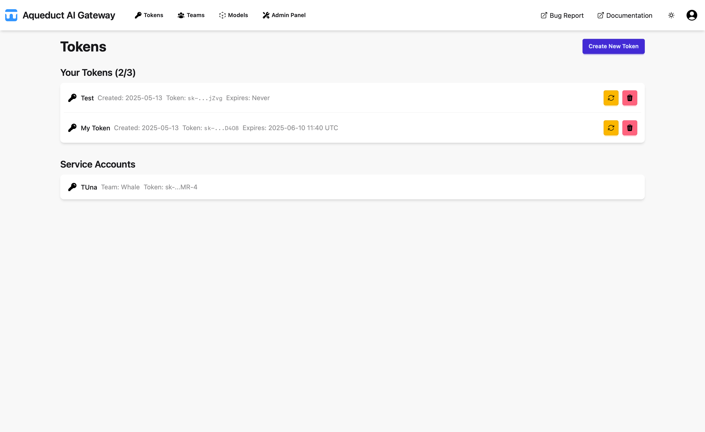

# Tokens

By default, the application opens on the Tokens page, where users can view their accessible tokens, including personal
tokens and those from service accounts.

Users can create new tokens to access models (LLMs) via the API. Only a preview of the token is shown, as the actual
value is not stored in the database. Users must copy and save the token value upon creation, for example in a password
manager such as 1Password.

Note: Aqueduct functions as a pass-through, so the API is determined by the model provider. Currently, only
OpenAI-compatible APIs are supported, including local models via vLLM or other OpenAI-compatible servers, as well as the
OpenAI API.

A created token is valid for all available models and is used for API authentication. Tokens become invalid upon
expiration and cannot be used for authentication thereafter. Tokens without an expiration date never expire.

To create a token, click the "Create New Token" button to open the token creation form.

Users can assign a name to the token and set an expiration date. To create a token that never expires, leave the
expiration date blank. Token values are randomly generated and cannot be set manually.

There is a fixed limit to the number of tokens a user can generate. This limit does not apply to service accounts, which
have a separate, predefined limit.

Token values can be regenerated for existing tokens using the regenerate ("🔄") button. Tokens can be deleted using the
delete ("🗑") button.

Service accounts are managed in the Teams view by users with Team Admin permissions.
