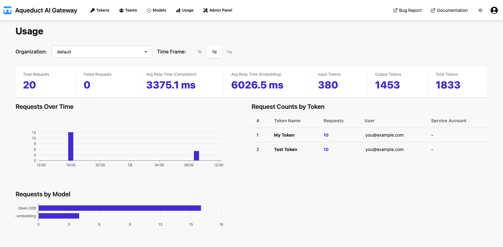

# Usage Dashboard
{: .no_toc }

## Table of contents
{: .no_toc .text-delta }

1. TOC
{:toc}

---

## Overview

The Usage Dashboard provides an overview of API usage across your organization or for individual tokens. You can filter the data by organization scope and time frame, and view key metrics, time-series charts, and breakdowns by token and model.

## Organization and Time Frame Filters

At the top of the page, use the **Organization** dropdown (available to global admins) to select `All` organizations or a specific organization. Standard users see their own organization by default.

Select the **Time Frame** (`1h`, `1d`, or `1w`) to adjust the period over which usage data is displayed.

## Metrics Bar

Below the filters, the metrics bar shows aggregate statistics for the selected organization and time frame:

- **Total Requests:** Total number of requests.
- **Failed Requests:** Number of requests with HTTP status ≥ 400.
- **Avg Resp Time (Completion):** Average response time in milliseconds for completion requests.
- **Avg Resp Time (Embedding):** Average response time in milliseconds for embedding requests.
- **Input Tokens:** Total number of input tokens consumed.
- **Output Tokens:** Total number of output tokens returned.
- **Total Tokens:** Sum of input and output tokens.

## Requests Over Time

The **Requests Over Time** chart displays a time-series of request counts for the selected period. It uses one-minute, one-hour, or one-day buckets for `1h`, `1d`, and `1w` spans, respectively.

## Request Counts by Token / Organization / User ID

The table on the right lists the top tokens (when scoped to an organization) or top organizations
(when viewing all), or the top users (based on [`user_id`](../api/index.md#sending-user_id-in-api-request),
when scoped to a token). Columns include:

- **#**: Rank.
- **Token Name / Organization / User ID**: Name of the token or organization, or `user_id` value.
- **Requests**: Number of requests.
- **Input Tokens**: Total input tokens consumed.
- **Output Tokens**: Total output tokens returned.
- **Total Tokens**: Sum of input and output tokens.
- **Token Owner**: Token owner's email (for tokens).
- **Service Account**: Service account name (for tokens).

## Requests by Model

The **Requests by Model** bar chart shows the request count for each model, including models with zero requests. This helps identify which models are used most frequently.
