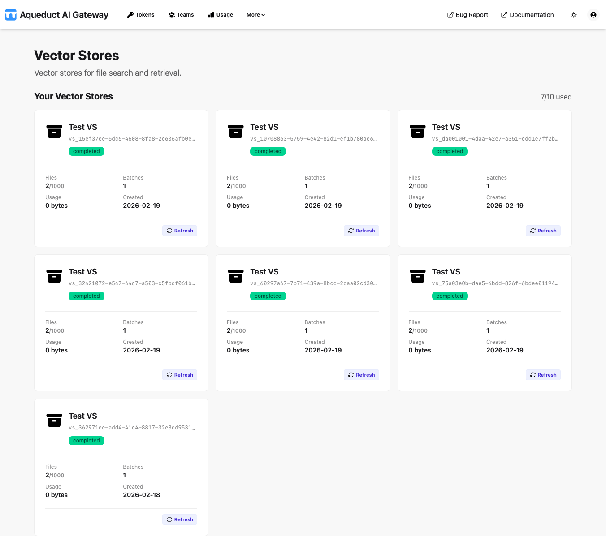

# Vector Stores

On the Vector Stores page, you can view and manage vector stores for semantic search and retrieval through the [Vector Stores API](../api/vector-stores.md).

Vector stores contain files that are chunked, embedded, and indexed for efficient similarity search, powering features like file search and retrieval.

## Your Vector Stores

The "Your Vector Stores" section displays a quota indicator (e.g., "7/10 used") showing your current usage against the maximum allowed vector stores for your token.

Each vector store is displayed as a card showing:

- **Header**: The vector store name with a truncated unique ID (e.g., "Test VS" + `vs_15ef37ee...`).
- **Status**: A badge indicating the processing status.
- **Files**: The number of files in the store (e.g., "2/1000").
- **Batches**: The number of file batches.
- **Usage**: Storage usage in bytes.
- **Created**: The creation date (e.g., "2026-02-19").
- **Refresh**: Button to update the card's data.

## Team Vector Stores

Team-owned vector stores (if available) would appear in a separate section, displaying resources shared with or owned by your teams. This section follows the same card layout and functionality.

For detailed API usage, parameters, and examples, see the [Vector Stores API reference](../api/vector-stores.md).
